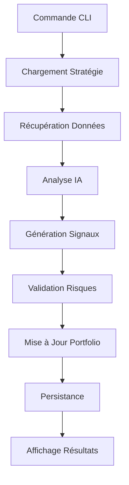
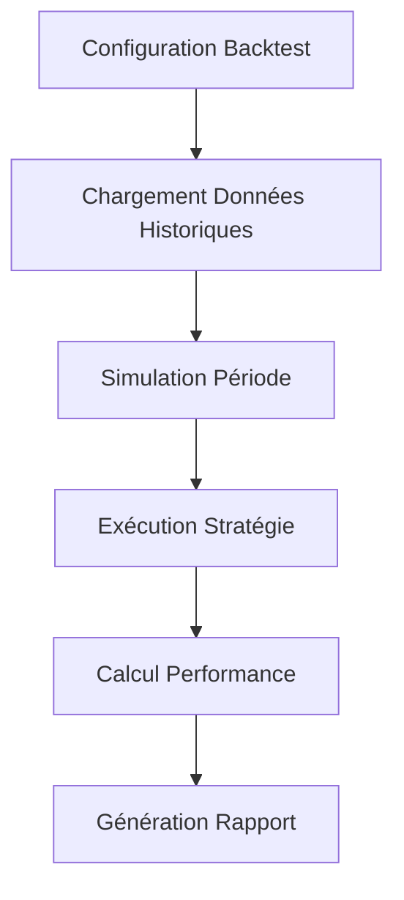
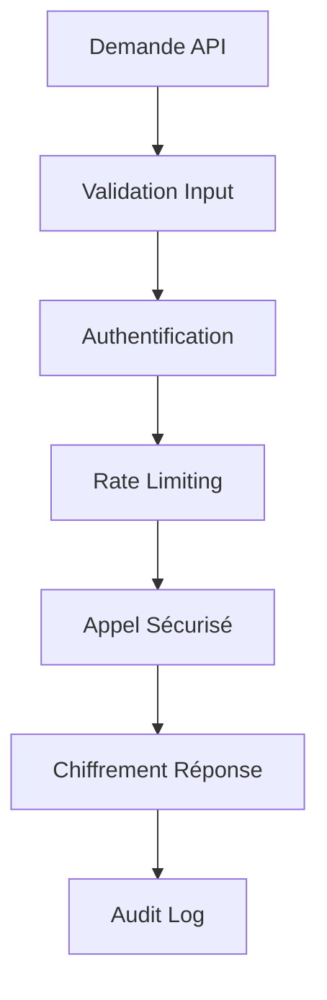

# Architecture Complète - Agent IA Financier
## Document de Référence Technique

**Version** : 1.0  
**Date** : Août 2024  
**Auteur** : Architecture Team  
**Statut** : Final Design  

---

## Table des Matières

1. [Vue d'Ensemble](#1-vue-densemble)
2. [Contexte et Objectifs](#2-contexte-et-objectifs)
3. [Architecture Globale](#3-architecture-globale)
4. [Composants Détaillés](#4-composants-détaillés)
5. [Technologies et Dépendances](#5-technologies-et-dépendances)
6. [Sécurité et Robustesse](#6-sécurité-et-robustesse)
7. [Structure du Projet](#7-structure-du-projet)
8. [Workflows Principaux](#8-workflows-principaux)
9. [Points de Décision Architecturaux](#9-points-de-décision-architecturaux)
10. [Plan d'Implémentation](#10-plan-dimplémentation)

---

## 1. Vue d'Ensemble

### 1.1 Mission de l'Agent IA Financier

L'agent IA financier est conçu pour fournir aux traders particuliers un système d'analyse et de prise de décision autonome et intelligent. Il combine l'intelligence artificielle de Claude avec des données financières de qualité institutionnelle via OpenBB pour générer des recommandations d'investissement personnalisées.

### 1.2 Caractéristiques Clés

- **Interface CLI uniquement** : Optimisée pour traders techniques
- **IA avancée** : Intégration Claude via OpenRouter
- **Données institutionnelles** : OpenBB comme source principale
- **Mémoire persistante** : Apprentissage et amélioration continue
- **Stratégies configurables** : YAML/JSON pour personnalisation
- **Sécurité renforcée** : Chiffrement et gestion sécurisée des clés

### 1.3 Principes Architecturaux

1. **Modularité** : Composants découplés et remplaçables
2. **Extensibilité** : Facilité d'ajout de nouvelles fonctionnalités
3. **Sécurité par conception** : Protection des données sensibles
4. **Résilience** : Gestion d'erreurs et récupération automatique
5. **Performance** : Cache multi-niveaux et optimisations
6. **Observabilité** : Logging et monitoring complets

---

## 2. Contexte et Objectifs

### 2.1 Analyse des Besoins

**Utilisateurs cibles** : Traders particuliers avec connaissances techniques  
**Volume** : 10-50 actions simultanées  
**Fréquence** : Analyse quotidienne  
**Interface** : CLI seulement  
**Déploiement** : Local (poste utilisateur)  

### 2.2 Cas d'Usage Principaux

```yaml
Cas d'usage prioritaires:
  1. Analyse matinale: finagent analyze --watchlist my_stocks
  2. Création stratégie: finagent strategy create --template momentum
  3. Suivi portefeuille: finagent portfolio status
  4. Rapport performance: finagent report --period month
  5. Simulation: finagent simulate buy AAPL 100 --strategy growth
```

### 2.3 Contraintes Techniques

- **Langage** : Python 3.11+
- **Base de données** : SQLite (simplicité)
- **Cache** : Mémoire + fichiers (pas de Redis requis)
- **APIs externes** : OpenBB, OpenRouter/Claude
- **Sécurité** : Keyring OS + chiffrement local
- **Packaging** : Poetry pour gestion dépendances

---

## 3. Architecture Globale

### 3.1 Vue en Couches

```
┌─────────────────────────────────────────────┐
│           Interface Layer (CLI)             │
├─────────────────────────────────────────────┤
│         Business Logic Layer               │
│  ┌─────────────┐  ┌─────────────┐         │
│  │ Strategy    │  │ Portfolio   │         │
│  │ Engine      │  │ Manager     │         │
│  └─────────────┘  └─────────────┘         │
├─────────────────────────────────────────────┤
│          AI Integration Layer              │
│  ┌─────────────┐  ┌─────────────┐         │
│  │ Claude      │  │ Memory      │         │
│  │ Client      │  │ System      │         │
│  └─────────────┘  └─────────────┘         │
├─────────────────────────────────────────────┤
│             Data Layer                     │
│  ┌─────────────┐  ┌─────────────┐         │
│  │ OpenBB      │  │ Cache       │         │
│  │ Provider    │  │ Manager     │         │
│  └─────────────┘  └─────────────┘         │
├─────────────────────────────────────────────┤
│          Persistence Layer                 │
│  ┌─────────────┐  ┌─────────────┐         │
│  │ SQLite      │  │ File        │         │
│  │ Database    │  │ Storage     │         │
│  └─────────────┘  └─────────────┘         │
├─────────────────────────────────────────────┤
│          Infrastructure Layer              │
│  ┌─────────────┐  ┌─────────────┐         │
│  │ Security    │  │ Error       │         │
│  │ Manager     │  │ Handler     │         │
│  └─────────────┘  └─────────────┘         │
└─────────────────────────────────────────────┘
```

### 3.2 Flux de Données Principal

1. **Entrée utilisateur** → CLI Handler
2. **Parsing commandes** → Business Logic
3. **Récupération données** → Data Providers (OpenBB)
4. **Analyse IA** → Claude via OpenRouter
5. **Décision trading** → Strategy Engine
6. **Mise à jour portefeuille** → Portfolio Manager
7. **Persistance** → Database + File Storage
8. **Retour utilisateur** → CLI Output

### 3.3 Communication Inter-Composants

- **Synchrone** : CLI → Business Logic → Data Layer
- **Asynchrone** : IA Analysis, Data Fetching
- **Event-driven** : Portfolio updates, Risk alerts
- **Cache-first** : Market data, AI responses

---

## 4. Composants Détaillés

### 4.1 Interface CLI (`finagent/cli/`)

**Responsabilités :**
- Parsing et validation des commandes
- Formatage et affichage des résultats
- Gestion des erreurs utilisateur
- Interface interactive pour configuration

**Commandes principales :**
```bash
finagent strategy {create,list,validate,backtest,deploy}
finagent portfolio {status,history,performance}
finagent analysis {run,schedule,report}
finagent config {setup,show,update}
```

**Technologies :** Click + Rich + Typer (optionnel)

### 4.2 Business Logic (`finagent/business/`)

#### 4.2.1 Strategy Engine
- **Chargement stratégies** depuis YAML/JSON
- **Validation configurations** avec schemas
- **Exécution stratégies** sur données de marché
- **Support multi-types** : Technical, Fundamental, Hybrid

#### 4.2.2 Decision Engine  
- **Génération signaux** basée sur analyse IA
- **Gestion des risques** avec limites configurables
- **Scoring de confiance** avec historique
- **Filtrage signaux** selon critères utilisateur

#### 4.2.3 Portfolio Manager
- **Suivi positions** en temps réel
- **Calcul performances** avec métriques avancées
- **Simulation trades** avant exécution
- **Historique complet** des décisions

### 4.3 AI Integration (`finagent/ai/`)

#### 4.3.1 Claude Provider
```python
class ClaudeProvider:
    async def analyze_market_data(self, context: MarketContext) -> AnalysisResult
    async def generate_decision(self, analysis: AnalysisResult) -> Decision
    async def explain_reasoning(self, decision: Decision) -> str
```

#### 4.3.2 Memory System
- **Short-term** : Session actuelle, données temporaires
- **Long-term** : Patterns, performances historiques
- **Episodic** : Situations de marché spécifiques
- **Pattern** : Reconnaissance automatique de motifs

### 4.4 Data Layer (`finagent/data/`)

#### 4.4.1 Market Data Service
```python
class MarketDataService:
    async def get_realtime_price(self, symbol: str) -> Price
    async def get_historical_data(self, symbol: str, period: str) -> List[OHLCV]
    async def get_technical_indicators(self, symbol: str) -> Dict[str, float]
```

#### 4.4.2 Cache Management
- **L1 Cache** : Mémoire (1000 items, TTL court)
- **L2 Cache** : Fichiers (données récentes)
- **L3 Cache** : Base de données (historique)

### 4.5 Persistence Layer (`finagent/persistence/`)

#### 4.5.1 SQLite Schema
```sql
-- Utilisateurs et configuration
users, user_settings

-- Stratégies et versions
strategies, strategy_versions, strategy_performance

-- Portefeuille et transactions  
portfolios, positions, transactions

-- Cache et métadonnées
market_data_cache, symbols_metadata

-- IA et apprentissage
ai_memory, decision_history, pattern_recognition

-- Alertes et notifications
alerts
```

#### 4.5.2 Repository Pattern
```python
class IRepository[T]:
    async def save(self, entity: T) -> T
    async def find_by_id(self, id: str) -> Optional[T]
    async def find_all(self, filters: Dict) -> List[T]
    async def delete(self, id: str) -> bool
```

---

## 5. Technologies et Dépendances

### 5.1 Stack Technique Principal

```toml
[tool.poetry.dependencies]
python = "^3.11"

# CLI & Interface
click = "^8.1.7"
rich = "^13.7.0"

# Data & Finance  
openbb = "^4.1.0"
pandas = "^2.1.4"
numpy = "^1.26.2"

# IA & HTTP
openai = "^1.12.0"  # Compatible OpenRouter
httpx = "^0.27.0"
tenacity = "^8.2.3"

# Database & ORM
sqlalchemy = "^2.0.25"
alembic = "^1.13.1"

# Configuration & Validation
pydantic = "^2.5.3"
pyyaml = "^6.0.1"

# Security
cryptography = "^42.0.2"
keyring = "^24.3.0"

# Logging & Utilities
structlog = "^23.2.0"
arrow = "^1.3.0"
```

### 5.2 Outils de Développement

```toml
[tool.poetry.group.dev.dependencies]
pytest = "^7.4.4"
black = "^23.12.1"
ruff = "^0.1.9" 
mypy = "^1.8.0"
coverage = "^7.4.0"
```

### 5.3 Justifications Techniques

- **SQLite** : Simplicité, pas de serveur, parfait pour usage local
- **Click** : Standard industrie pour CLI Python
- **httpx** : Moderne, async, compatible avec OpenRouter
- **Pydantic** : Validation robuste et sérialisation
- **Structlog** : Logging structuré pour observabilité

---

## 6. Sécurité et Robustesse

### 6.1 Architecture de Sécurité

#### 6.1.1 Gestion des Secrets
```python
class SecretManager:
    # Stockage sécurisé via OS Keyring
    def store_secret(self, key: str, value: str) -> None
    def get_secret(self, key: str) -> Optional[str]
    
    # Chiffrement local avec Fernet
    def encrypt_data(self, data: bytes) -> Tuple[bytes, bytes, bytes]
    def decrypt_data(self, encrypted: bytes, salt: bytes, iv: bytes) -> bytes
```

#### 6.1.2 Validation et Sanitisation
- **Input validation** pour toutes les entrées utilisateur
- **SQL injection** prévention via ORM SQLAlchemy
- **Path traversal** protection pour fichiers
- **Rate limiting** pour APIs externes

### 6.2 Patterns de Résilience

#### 6.2.1 Circuit Breaker
```python
@circuit_breaker(failure_threshold=5, recovery_timeout=60)
async def call_external_api():
    # Appel API avec protection circuit breaker
```

#### 6.2.2 Retry avec Backoff Exponentiel
```python
@retry(
    stop=stop_after_attempt(3),
    wait=wait_exponential(multiplier=1, min=1, max=10)
)
async def fetch_market_data():
    # Récupération données avec retry automatique
```

### 6.3 Monitoring et Observabilité

#### 6.3.1 Logging Structuré
```python
logger.info(
    "Strategy executed",
    strategy_name="momentum",
    symbols=["AAPL", "MSFT"],
    performance=0.15,
    execution_time=2.3
)
```

#### 6.3.2 Métriques de Performance
- Temps de réponse API
- Taux de réussite cache
- Performance des stratégies
- Utilisation ressources

---

## 7. Structure du Projet

### 7.1 Organisation des Fichiers

```
finagent/
├── finagent/                  # Package principal
│   ├── cli/                   # Interface ligne de commande
│   ├── business/              # Logique métier
│   ├── ai/                    # Services IA
│   ├── data/                  # Accès aux données
│   ├── persistence/           # Persistance
│   └── core/                  # Services transversaux
├── tests/                     # Tests (unit, integration, security)
├── docs/                      # Documentation
├── scripts/                   # Scripts utilitaires
└── templates/                 # Templates stratégies
```

### 7.2 Conventions de Nommage

- **Fichiers** : `snake_case.py`
- **Classes** : `PascalCase`
- **Fonctions** : `snake_case`
- **Constantes** : `UPPER_CASE`
- **Interfaces** : `IServiceName`

### 7.3 Configuration du Projet

- **Poetry** pour gestion dépendances
- **Black** pour formatage code
- **Ruff** pour linting rapide
- **MyPy** pour vérification types
- **Pytest** pour tests

---

## 8. Workflows Principaux

### 8.1 Workflow d'Analyse Complète



### 8.2 Workflow de Backtesting



### 8.3 Workflow de Sécurité



---

## 9. Points de Décision Architecturaux

### 9.1 Choix de Base de Données

**Décision** : SQLite  
**Alternatives considérées** : PostgreSQL, MongoDB  
**Justification** :
- ✅ Simplicité déploiement (pas de serveur)
- ✅ Performance suffisante pour usage local
- ✅ Support ACID complet
- ✅ Ecosystem Python mature
- ❌ Pas de scaling horizontal (non requis)

### 9.2 Choix d'Interface Utilisateur

**Décision** : CLI uniquement  
**Alternatives considérées** : Web UI, Desktop GUI  
**Justification** :
- ✅ Target utilisateurs techniques
- ✅ Scriptable et automatisable
- ✅ Ressources développement concentrées
- ✅ Performance et simplicité
- ❌ Courbe d'apprentissage plus raide

### 9.3 Choix Architecture IA

**Décision** : Claude via OpenRouter  
**Alternatives considérées** : OpenAI direct, models locaux  
**Justification** :
- ✅ Qualité d'analyse supérieure
- ✅ Coût raisonnable via OpenRouter
- ✅ Pas de fine-tuning requis
- ✅ Support context long
- ❌ Dépendance externe

### 9.4 Choix Pattern Architecture

**Décision** : Layered + DDD + Repository  
**Alternatives considérées** : MVC, Microservices  
**Justification** :
- ✅ Séparation responsabilités claire
- ✅ Testabilité optimale
- ✅ Extensibilité future
- ✅ Complexité maîtrisée
- ❌ Plus de boilerplate initial

---

## 10. Plan d'Implémentation

### 10.1 Phase 1 : Fondations (Semaines 1-2)

**Objectif** : Infrastructure de base fonctionnelle

```yaml
Tâches prioritaires:
  - Mise en place projet Poetry
  - Configuration base SQLite + Alembic  
  - CLI basique avec Click
  - Système de configuration
  - Logging structuré
  - Tests infrastructure
```

**Livrables** :
- ✅ Projet initialisé et configurable
- ✅ Base de données opérationnelle
- ✅ CLI de base fonctionnelle
- ✅ Tests passants

### 10.2 Phase 2 : Intégrations Externes (Semaines 3-4)

**Objectif** : Connectivité aux APIs externes

```yaml
Tâches prioritaires:
  - Provider OpenBB fonctionnel
  - Client Claude via OpenRouter
  - Système de cache multi-niveaux
  - Gestion sécurisée des clés API
  - Retry et circuit breaker
  - Tests d'intégration
```

**Livrables** :
- ✅ Données de marché accessibles
- ✅ IA Claude opérationnelle  
- ✅ Cache performant
- ✅ Sécurité des APIs

### 10.3 Phase 3 : Logique Métier (Semaines 5-7)

**Objectif** : Fonctionnalités core business

```yaml
Tâches prioritaires:
  - Moteur de stratégies YAML
  - Templates stratégies de base
  - Portfolio manager complet
  - Decision engine avec IA
  - Système de mémoire IA
  - Backtesting engine
```

**Livrables** :
- ✅ Stratégies configurables
- ✅ Analyse IA fonctionnelle
- ✅ Gestion portefeuille
- ✅ Historique et apprentissage

### 10.4 Phase 4 : Finalisation (Semaines 8-9)

**Objectif** : Polissage et robustesse

```yaml
Tâches prioritaires:
  - CLI avancée et interactive
  - Formatage outputs (tables, graphiques)
  - Monitoring et alertes
  - Documentation utilisateur
  - Tests complets (unit + integration)
  - Packaging et distribution
```

**Livrables** :
- ✅ UX CLI optimisée
- ✅ Système robuste et monitoré
- ✅ Documentation complète
- ✅ Package distribuable

### 10.5 Critères de Succès

#### 10.5.1 Fonctionnels
- [ ] Analyse stratégie momentum sur 10 actions en < 30s
- [ ] Génération signaux avec justification IA
- [ ] Backtest 1 an de données en < 2 minutes  
- [ ] Persistance historique décisions et performance
- [ ] Interface CLI intuitive et bien documentée

#### 10.5.2 Non-Fonctionnels
- [ ] 95% uptime des APIs externes gérées
- [ ] Temps de réponse < 5s pour analyses courantes
- [ ] Sécurité clés API avec chiffrement local
- [ ] Cache hit ratio > 80% pour données récentes
- [ ] Couverture tests > 85%

#### 10.5.3 Techniques
- [ ] Code quality score > 8/10 (SonarQube)
- [ ] Type coverage > 90% (MyPy)
- [ ] Documentation API complète
- [ ] Logs structurés pour observabilité
- [ ] Package Poetry installable facilement

---

## Conclusion

Cette architecture fournit une base solide pour développer un agent IA financier moderne, sécurisé et performant. Elle respecte les principes de clean architecture tout en restant pragmatique pour les besoins spécifiques des traders particuliers.

**Points forts de l'architecture :**
- 🎯 **Focalisée** sur les besoins réels des traders
- 🔧 **Modulaire** et facilement extensible
- 🛡️ **Sécurisée** par conception
- ⚡ **Performante** avec cache intelligent
- 🤖 **IA-native** avec mémoire persistante
- 📊 **Observable** avec monitoring complet

**Prochaines étapes :**
1. Validation architecture avec stakeholders
2. Mise en place environnement développement
3. Démarrage Phase 1 d'implémentation
4. Itérations courtes avec feedback utilisateur

Cette documentation servira de référence tout au long du développement et évoluera avec le projet.

---

**Document contrôlé** - Toute modification doit être approuvée par l'architecte technique.