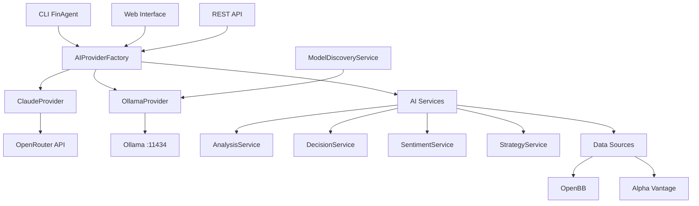

# FinAgent - Agent Financier IA 🤖💼

Agent financier intelligent utilisant l'IA pour l'analyse de marché, la prise de décision de trading, et la gestion de portefeuille.

## 🚀 Fonctionnalités

### ✅ Intégration IA Multi-Providers
- **Claude (OpenRouter)** : Modèles premium pour analyses complexes
- **Ollama Local** : Modèles locaux pour la confidentialité et le contrôle
- **Fallback intelligent** : Basculement automatique entre providers
- **Auto-discovery** : Détection automatique des modèles disponibles

### 🧠 Services IA
- **Analyse Financière** : Analyse technique et fondamentale
- **Décision de Trading** : Recommandations d'achat/vente intelligentes  
- **Analyse de Sentiment** : Analyse des nouvelles et réseaux sociaux
- **Stratégies** : Génération et optimisation de stratégies de trading
- **Gestion de Portefeuille** : Rééquilibrage et allocation d'actifs

### 📊 Sources de Données
- **OpenBB** : Données financières et économiques
- **Alpha Vantage** : Prix en temps réel et indicateurs techniques
- **Market Data** : Intégration multi-sources robuste

### 🔧 Outils et Interfaces
- **CLI avancé** : Interface en ligne de commande complète
- **API REST** : Endpoints pour intégration externe
- **WebUI** : Interface web interactive (à venir)
- **Configuration flexible** : YAML et variables d'environnement

## 📦 Installation

### Prérequis
- Python 3.11+
- pip ou poetry
- (Optionnel) Ollama pour les modèles locaux

### Installation rapide

```bash
# Clonage du repository
git clone https://github.com/your-repo/finagent.git
cd finagent

# Installation des dépendances
pip install -r requirements.txt

# Ou avec poetry
poetry install

# Configuration
cp .env.example .env
# Éditez .env avec vos clés API
```

### Installation avec Ollama (recommandé)

```bash
# Installation automatique d'Ollama
python scripts/setup_ollama.py

# Ou installation manuelle
curl -fsSL https://ollama.ai/install.sh | sh
ollama serve
ollama pull llama3.1:8b
```

## ⚙️ Configuration

### Variables d'environnement

```bash
# Provider Claude (OpenRouter)
OPENROUTER_API_KEY=your_openrouter_key
CLAUDE_MODEL=anthropic/claude-3.5-sonnet-20241022

# Provider Ollama
OLLAMA_HOST=localhost
OLLAMA_PORT=11434
OLLAMA_DEFAULT_MODEL=llama3.1:8b
OLLAMA_AUTO_PULL=true

# Configuration générale AI
AI_PREFERRED_PROVIDER=auto
AI_FALLBACK_STRATEGY=auto
AI_ENABLE_AUTO_DISCOVERY=true

# Sources de données
OPENBB_PAT=your_openbb_token
ALPHA_VANTAGE_API_KEY=your_alphavantage_key
```

### Configuration avancée

```yaml
# config/ai_config.yaml
ai:
  preferred_provider: ollama
  fallback_strategy: ollama_to_claude
  
  claude:
    api_key: ${OPENROUTER_API_KEY}
    base_url: "https://openrouter.ai/api/v1"
    default_model: "anthropic/claude-3.5-sonnet-20241022"
    
  ollama:
    host: localhost
    port: 11434
    auto_pull: true
    default_model: "llama3.1:8b"
    timeout: 60
```

## 🎯 Usage

### Interface CLI

```bash
# Vérification du statut
finagent ai status

# Analyse d'une action
finagent analyze AAPL --provider ollama

# Recommandation de trading
finagent trade --symbol TSLA --amount 1000

# Gestion de modèles Ollama
finagent ai models
finagent ai pull llama3.1:8b

# Analyse de portefeuille
finagent portfolio analyze --file my_portfolio.json
```

### API Python

```python
from finagent.ai import create_ai_provider, ProviderType, ModelType

# Provider avec sélection automatique
provider = await create_ai_provider(task_type="analysis")

# Provider spécifique
ollama_provider = await create_ai_provider(ProviderType.OLLAMA)

# Analyse financière
response = await provider.generate_response(
    "Analyse l'action Apple (AAPL) et donne une recommandation",
    model=ModelType.LLAMA3_1_8B,
    max_tokens=1000
)

print(response)
```

### Services IA

```python
from finagent.ai.services import (
    create_analysis_service,
    create_decision_service,
    ProviderType
)

# Service d'analyse avec Ollama
analysis_service = await create_analysis_service(ProviderType.OLLAMA)

# Analyse financière complète
analysis = await analysis_service.analyze_stock("AAPL")
print(f"Recommandation: {analysis.recommendation}")

# Service de décision
decision_service = await create_decision_service()
decision = await decision_service.make_trading_decision(request)
```

## 🤖 Modèles Supportés

### Modèles Claude (OpenRouter)
- `claude-3.5-sonnet` - Modèle le plus capable (recommandé)
- `claude-3-sonnet` - Équilibre performance/coût
- `claude-3-haiku` - Rapide et économique
- `claude-3-opus` - Maximum de qualité

### Modèles Ollama Locaux

| Modèle | Taille | RAM | Usage recommandé |
|--------|--------|-----|------------------|
| **Llama 3.1 8B** | 4.7GB | 8GB | Usage général, analyses |
| **Llama 3.1 70B** | 40GB | 64GB | Analyses complexes |
| **Mistral 7B** | 4.1GB | 8GB | Rapide, conversations |
| **CodeLlama 7B** | 3.8GB | 8GB | Génération de code |
| **Gemma 7B** | 4.8GB | 8GB | Chat, résumés |
| **Phi3 Mini** | 2.3GB | 4GB | Ultra-rapide |

### Recommandations par tâche

```python
# Analyse financière approfondie
ModelType.CLAUDE_3_5_SONNET  # Meilleure qualité
ModelType.LLAMA3_1_8B        # Local équilibré

# Conversations rapides
ModelType.CLAUDE_3_HAIKU     # Cloud rapide
ModelType.GEMMA_7B           # Local rapide

# Génération de code
ModelType.CLAUDE_3_5_SONNET  # Excellent pour code complexe
ModelType.CODELLAMA_7B       # Spécialisé programmation
```

## 🏗️ Architecture

### Vue d'ensemble



### Composants principaux

- **AIProviderFactory** : Gestion centralisée des providers
- **ModelDiscoveryService** : Auto-discovery des modèles Ollama
- **AI Services** : Services métier utilisant l'IA
- **Fallback System** : Basculement intelligent entre providers
- **Configuration System** : Gestion flexible de la configuration

## 🧪 Tests

```bash
# Tests unitaires
pytest tests/unit/ -v

# Tests d'intégration
pytest tests/integration/ -v -m integration

# Tests spécifiques Ollama
pytest tests/integration/test_ollama_integration.py -v

# Tous les tests
pytest -v --cov=finagent
```

## 📈 Exemples d'usage

### Analyse complète d'une action

```python
from finagent.ai.services import create_analysis_service
from finagent.ai.models.base import ProviderType

# Service avec Ollama local
service = await create_analysis_service(ProviderType.OLLAMA)

# Analyse d'Apple
analysis = await service.analyze_stock(
    symbol="AAPL",
    analysis_type="comprehensive",
    time_horizon="medium_term"
)

print(f"""
📊 Analyse Apple (AAPL)
======================
💰 Prix cible: ${analysis.price_target}
📈 Tendance: {analysis.trend}
⭐ Recommandation: {analysis.recommendation}
🎯 Confiance: {analysis.confidence_level}

📋 Résumé:
{analysis.summary}
""")
```

### Décision de trading automatisée

```python
from finagent.ai.services import create_decision_service
from finagent.ai.models.trading_decision import DecisionRequest, TradingContext

# Service de décision
decision_service = await create_decision_service()

# Contexte de trading
context = TradingContext(
    symbol="TSLA",
    current_price=250.00,
    portfolio_value=10000.00,
    position_size=0.0,
    risk_tolerance="moderate"
)

# Demande de décision
request = DecisionRequest(
    trading_context=context,
    strategy_name="growth_momentum",
    time_horizon="1w"
)

# Génération de la décision
decision = await decision_service.make_trading_decision(request)

print(f"""
🎯 Décision Tesla (TSLA)
=======================
🚀 Action: {decision.action}
💵 Quantité: {decision.quantity}
🎯 Prix cible: ${decision.target_price}
🛑 Stop loss: ${decision.stop_loss}
📊 Confiance: {decision.confidence}%

💡 Raisonnement:
{decision.reasoning}
""")
```

### Comparaison de providers

```python
# Analyse avec Claude
claude_service = await create_analysis_service(ProviderType.CLAUDE)
claude_response = await claude_service.analyze_market_sentiment("tech_stocks")

# Analyse avec Ollama  
ollama_service = await create_analysis_service(ProviderType.OLLAMA)
ollama_response = await ollama_service.analyze_market_sentiment("tech_stocks")

print(f"Claude: {claude_response.sentiment}")
print(f"Ollama: {ollama_response.sentiment}")
```

## 🔧 Développement

### Structure du projet

```
finagent/
├── ai/                     # Module IA principal
│   ├── providers/          # Providers Claude & Ollama
│   ├── services/           # Services IA métier
│   ├── models/             # Modèles de données
│   ├── factory.py          # Factory des providers
│   └── config.py           # Configuration multi-providers
├── business/               # Logique métier
│   ├── decision/           # Moteur de décision
│   ├── portfolio/          # Gestion de portefeuille
│   └── strategy/           # Stratégies de trading
├── data/                   # Sources de données
├── cli/                    # Interface CLI
├── api/                    # API REST
└── tests/                  # Tests
    ├── unit/               # Tests unitaires
    └── integration/        # Tests d'intégration
```

### Ajout d'un nouveau provider

```python
# 1. Créer le provider
class NewProvider(AIProvider):
    async def generate_response(self, prompt: str, **kwargs) -> str:
        # Implémentation
        pass

# 2. Ajouter dans la factory
# finagent/ai/factory.py
async def _create_provider(self, provider_type: ProviderType) -> AIProvider:
    if provider_type == ProviderType.NEW_PROVIDER:
        return NewProvider(self.config.new_provider)
    # ...

# 3. Étendre la configuration
# finagent/ai/config.py
class AIConfig:
    new_provider: Optional[NewProviderConfig] = None
```

## 🚀 Roadmap

### Version 1.1 (En cours)
- [x] ✅ Intégration Ollama complète
- [x] ✅ Factory multi-providers
- [x] ✅ Auto-discovery des modèles
- [x] ✅ Fallback intelligent
- [x] ✅ CLI étendu
- [ ] 🔄 Tests de performance
- [ ] 🔄 Métriques avancées

### Version 1.2 (À venir)
- [ ] Interface Web complète
- [ ] Support streaming responses
- [ ] Fine-tuning de modèles
- [ ] Cache intelligent des réponses
- [ ] API webhooks

### Version 2.0 (Future)
- [ ] Support multi-GPU pour Ollama
- [ ] Modèles personnalisés
- [ ] Trading automatique en live
- [ ] Notifications intelligentes
- [ ] Mobile app

## 🤝 Contribution

```bash
# Fork et clone
git fork https://github.com/your-repo/finagent
git clone https://github.com/your-username/finagent
cd finagent

# Installation développement
poetry install --with dev

# Tests avant commit
pytest
black finagent/
mypy finagent/

# Commit et PR
git commit -m "feat: nouvelle fonctionnalité"
git push origin feature-branch
```

## 📄 Licence

MIT License - voir [LICENSE](LICENSE) pour plus de détails.

## 🆘 Support

- **Documentation** : [docs/](docs/)
- **Issues** : [GitHub Issues](https://github.com/your-repo/finagent/issues)
- **Discussions** : [GitHub Discussions](https://github.com/your-repo/finagent/discussions)
- **Email** : support@finagent.ai

## 📊 Statut du projet


**Statut actuel** : ✅ Production Ready avec intégration Ollama complète

---

<div align="center">
  <strong>🤖 FinAgent - Votre assistant financier IA intelligent 💼</strong>
  <br>
  <em>Alimenté par Claude et Ollama pour des analyses financières de pointe</em>
</div>