# Diagrammes d'Architecture - Agent IA Financier

## Vue d'Ensemble

Cette collection de diagrammes Mermaid illustre l'architecture complète de l'agent IA financier, depuis la vue d'ensemble jusqu'aux détails d'implémentation.

## 1. Architecture Globale du Système

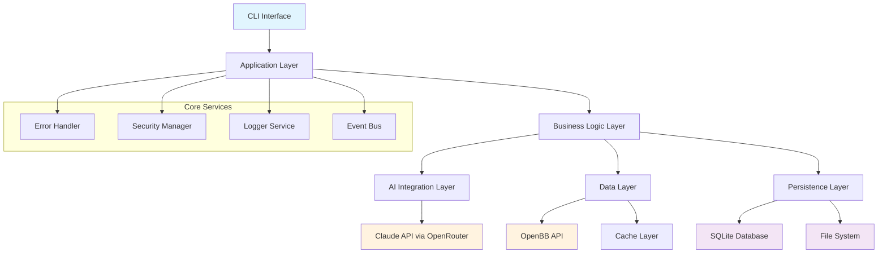

## 2. Flux de Données Principal

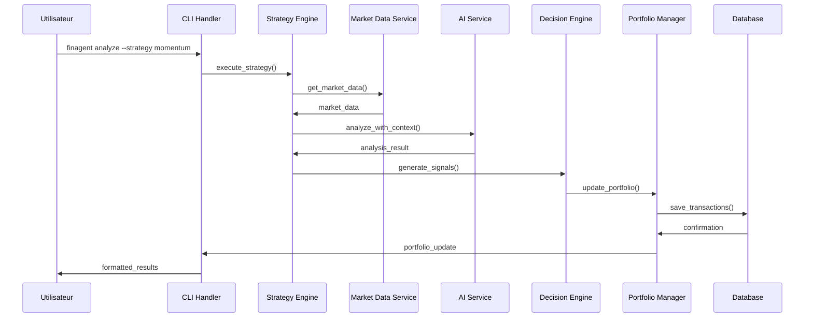

## 3. Architecture du Système de Stratégies

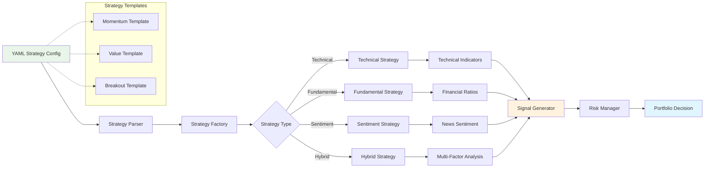

## 4. Architecture de Persistance Multi-Couches

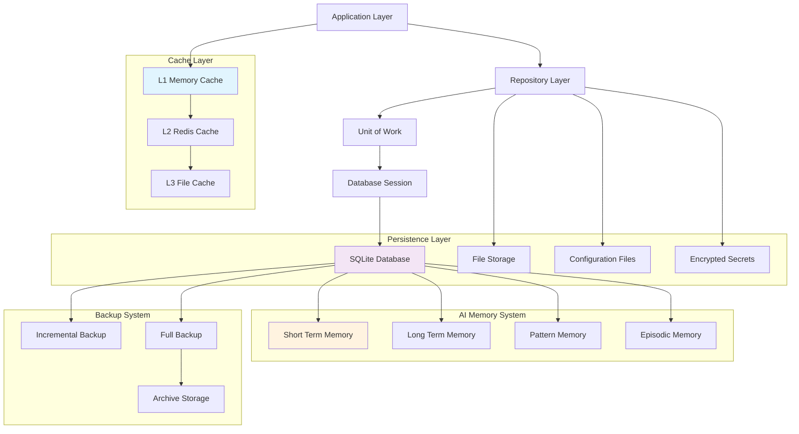

## 5. Workflow de Décision IA

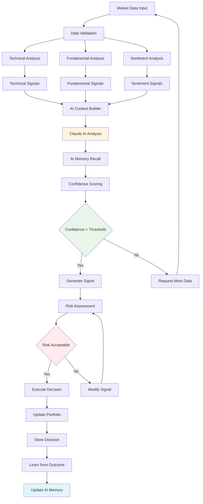

## 6. Architecture de Sécurité

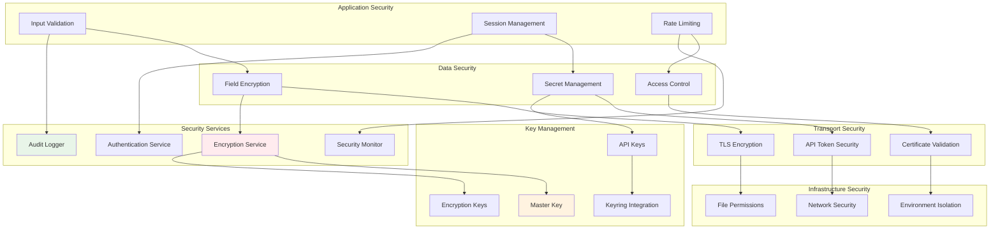

## 7. Diagramme de Composants CLI

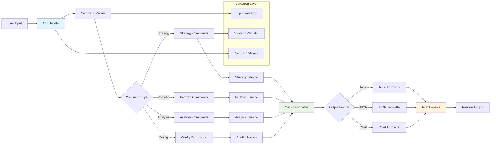

## 8. Architecture des Providers de Données

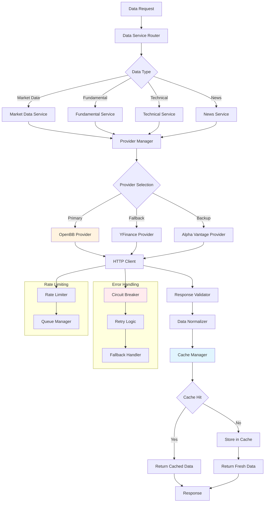

## 9. Workflow de Backtesting

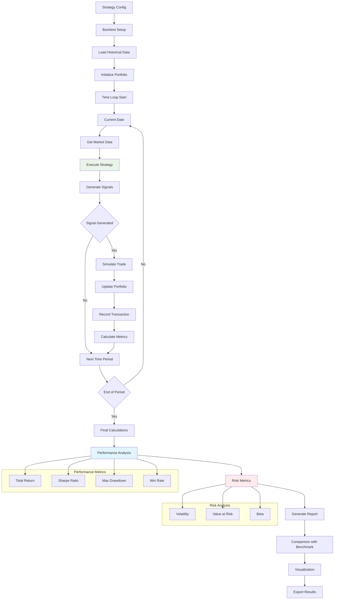

## 10. Architecture Event-Driven

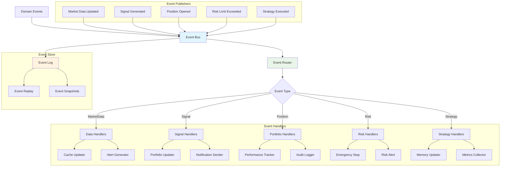

## 11. Diagramme de Déploiement

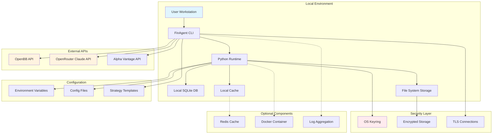

## 12. Diagramme de Classes Principales

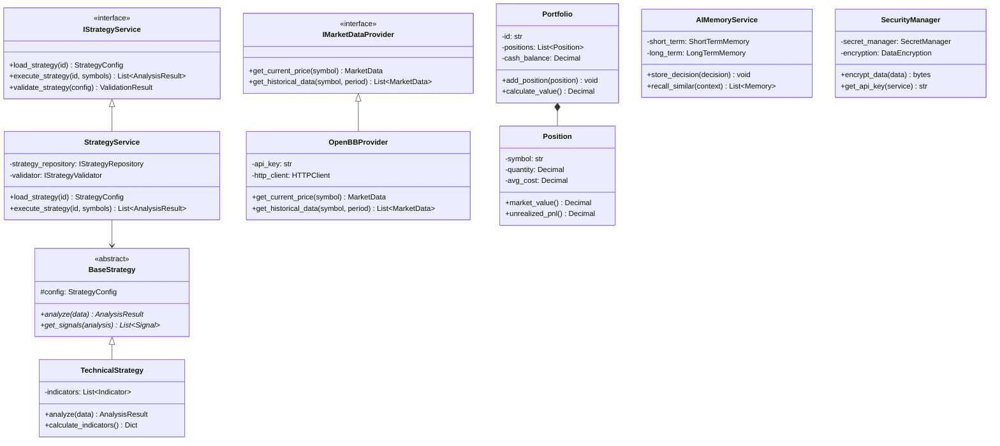

Ces diagrammes offrent une vue complète de :
- **Architecture système** : Vue d'ensemble et interactions
- **Flux de données** : Séquences et workflows
- **Composants métier** : Stratégies et décisions
- **Infrastructure** : Persistance et sécurité
- **Déploiement** : Configuration et environnement
- **Classes** : Structure orientée objet