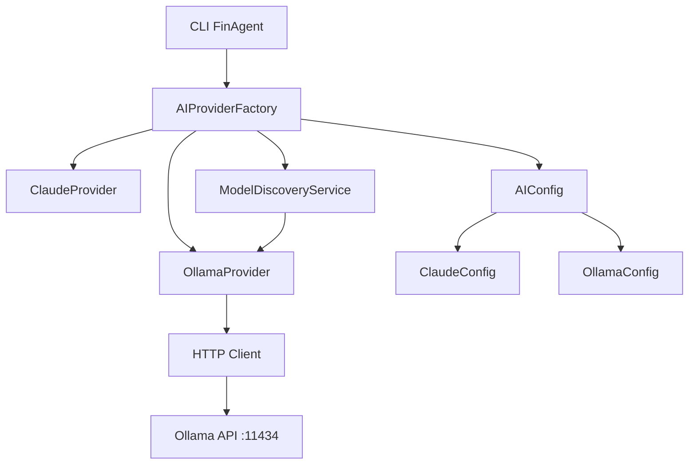

# Intégration Ollama dans FinAgent

## Vue d'ensemble

FinAgent supporte maintenant l'exécution de modèles de langage locaux via Ollama, offrant une alternative privacy-first à Claude. Cette intégration permet :

- **Exécution locale** : Aucune donnée envoyée vers des APIs externes
- **Fallback intelligent** : Basculement automatique entre Claude et Ollama
- **Discovery automatique** : Détection des modèles installés
- **Gestion des modèles** : Téléchargement et mise à jour automatiques

## Architecture

### Composants principaux

1. **OllamaProvider** : Provider AI pour communiquer avec Ollama
2. **ModelDiscoveryService** : Service de découverte des modèles
3. **AIProviderFactory** : Factory avec auto-sélection des providers
4. **Multi-Provider Config** : Configuration unifiée Claude + Ollama

### Diagramme d'architecture



## Installation et Configuration

### 1. Installation d'Ollama

#### Installation automatique (Linux/macOS)
```bash
python scripts/setup_ollama.py
```

#### Installation manuelle

**Linux/macOS :**
```bash
curl -fsSL https://ollama.ai/install.sh | sh
```

**Windows :**
1. Téléchargez l'installateur depuis https://ollama.ai/download
2. Exécutez l'installateur
3. Redémarrez votre terminal

### 2. Démarrage du service

```bash
# Démarrage du service Ollama
ollama serve

# Vérification du statut
curl http://localhost:11434/api/version
```

### 3. Configuration des variables d'environnement

Copiez `.env.example` vers `.env` et configurez :

```bash
# Configuration Ollama
OLLAMA_HOST=localhost
OLLAMA_PORT=11434
OLLAMA_DEFAULT_MODEL=llama3.1:8b
OLLAMA_AUTO_PULL=true

# Configuration multi-providers
AI_PREFERRED_PROVIDER=auto
AI_FALLBACK_STRATEGY=auto
AI_ENABLE_AUTO_DISCOVERY=true
```

## Modèles supportés

### Catégories de modèles

| Catégorie | Modèles | RAM requise | Use cases |
|-----------|---------|-------------|-----------|
| **Small** | Gemma 2B, Phi3 Mini | 4-6 GB | Réponses rapides, résumés |
| **Medium** | Llama 3.1 8B, Mistral 7B | 8-12 GB | Usage général, analyses |
| **Large** | Llama 3.1 70B, CodeLlama 13B | 16+ GB | Tâches complexes, code |

### Modèles recommandés par tâche

#### Analyse financière
- **Llama 3.1 8B** : Équilibre performance/qualité
- **Mistral 7B** : Bon pour l'analyse de données
- **Claude 3.5 Sonnet** : Référence qualité (fallback)

#### Génération de code
- **CodeLlama 7B/13B** : Spécialisé programmation
- **Llama 3.1 8B** : Bon usage général
- **Claude 3.5 Sonnet** : Excellent pour code complexe

#### Conversation/Chat
- **Gemma 7B** : Naturel et rapide
- **Llama 3.1 8B** : Très polyvalent
- **Phi3 Mini** : Ultra-rapide pour questions simples

## Utilisation

### Via l'interface CLI

```bash
# Statut des services AI
finagent ai status

# Liste des modèles disponibles
finagent ai models

# Test de connectivité
finagent ai test --provider ollama

# Téléchargement d'un modèle
finagent ai pull llama3.1:8b

# Analyse avec Ollama
finagent analyze AAPL --provider ollama --model llama3.1:8b
```

### Via l'API Python

```python
from finagent.ai import create_ai_provider, ModelType, ProviderType

# Création d'un provider Ollama
provider = await create_ai_provider(ProviderType.OLLAMA)

# Génération de réponse
response = await provider.generate_response(
    "Analyse les tendances du marché pour AAPL",
    model=ModelType.LLAMA3_1_8B,
    max_tokens=1000
)

# Provider avec fallback automatique
provider = await create_ai_provider(task_type="analysis")
response = await provider.generate_response("Votre prompt")
```

### Configuration avancée

```python
from finagent.ai.config import AIConfig, OllamaConfig, FallbackStrategy

# Configuration personnalisée
config = AIConfig(
    ollama=OllamaConfig(
        host="192.168.1.100",  # Ollama distant
        port=11434,
        auto_pull=True,
        timeout=180
    ),
    fallback_strategy=FallbackStrategy.OLLAMA_TO_CLAUDE,
    preferred_provider=ProviderType.OLLAMA
)
```

## Gestion des modèles

### Téléchargement automatique

Le service de discovery peut télécharger automatiquement les modèles manquants :

```python
from finagent.ai.services import get_discovery_service

discovery = await get_discovery_service()

# Téléchargement d'un modèle
success = await discovery.pull_model(ModelType.LLAMA3_1_8B)

# Vérification des modèles disponibles
available = discovery.get_available_models()
```

### Modèles recommandés par tâche

```python
# Recommandations automatiques
recommended = discovery.get_recommended_models_for_task("coding")
# Retourne: [ModelType.CODELLAMA_7B, ModelType.LLAMA3_1_8B, ...]
```

## Stratégies de fallback

### Configuration des fallbacks

```python
from finagent.ai.config import FallbackStrategy

# Aucun fallback
strategy = FallbackStrategy.NONE

# Claude vers Ollama
strategy = FallbackStrategy.CLAUDE_TO_OLLAMA

# Ollama vers Claude
strategy = FallbackStrategy.OLLAMA_TO_CLAUDE

# Fallback intelligent (recommandé)
strategy = FallbackStrategy.AUTO
```

### Comportement du fallback AUTO

1. **Provider préféré** : Utilise le provider configuré en priorité
2. **Santé des providers** : Vérifie la disponibilité en temps réel
3. **Capacités du modèle** : Sélectionne selon la tâche
4. **Fallback intelligent** : Bascule automatiquement en cas d'erreur

## Monitoring et santé

### Vérification du statut

```bash
# Via CLI
finagent ai status

# Affiche:
# ✅ claude - disponible (45.2ms)
# ✅ ollama - disponible (12.1ms) - 3 modèles
```

### API de monitoring

```python
from finagent.ai import get_ai_factory

factory = await get_ai_factory()

# Statut de santé détaillé
health = factory.get_provider_health_status()
print(health)
# {
#   "claude": {"available": True, "response_time_ms": 45.2},
#   "ollama": {"available": True, "response_time_ms": 12.1, "models_available": 3}
# }
```

## Optimisation des performances

### Recommandations système

#### RAM
- **Minimum** : 8 GB pour modèles 7B
- **Recommandé** : 16 GB pour usage confortable
- **Optimal** : 32 GB+ pour modèles 70B

#### CPU
- **Compatible** : x86_64, ARM64 (Apple Silicon optimisé)
- **Recommandé** : 8+ cores pour modèles larges

#### Stockage
- **Espace** : 4-50 GB par modèle selon la taille
- **Type** : SSD recommandé pour les performances

### Configuration de performance

```bash
# Variables d'environnement pour optimisation
OLLAMA_NUM_PARALLEL=2        # Requêtes parallèles
OLLAMA_MAX_LOADED_MODELS=3   # Modèles en mémoire
OLLAMA_MAX_QUEUE=512         # Taille de la queue
```

## Sécurité et confidentialité

### Avantages privacy

- **Données locales** : Aucune transmission vers des APIs externes
- **Contrôle total** : Gestion complète des modèles et données
- **Conformité** : Respect des politiques de confidentialité strictes

### Configuration sécurisée

```bash
# Ollama en mode local uniquement (recommandé)
OLLAMA_HOST=127.0.0.1
OLLAMA_ORIGINS="http://localhost,http://127.0.0.1"

# Logs et monitoring
OLLAMA_DEBUG=false
OLLAMA_KEEP_ALIVE=5m
```

## Dépannage

### Problèmes courants

#### Ollama ne démarre pas
```bash
# Vérification du service
ps aux | grep ollama

# Redémarrage
pkill ollama
ollama serve
```

#### Modèle non trouvé
```bash
# Liste des modèles installés
ollama list

# Téléchargement manuel
ollama pull llama3.1:8b
```

#### Erreurs de mémoire
```bash
# Vérification de l'utilisation RAM
htop
# Réduction du nombre de modèles chargés
export OLLAMA_MAX_LOADED_MODELS=1
```

#### Connectivité
```bash
# Test de connexion
curl -X POST http://localhost:11434/api/generate \
  -H "Content-Type: application/json" \
  -d '{"model": "llama3.1:8b", "prompt": "Test", "stream": false}'
```

### Logs et debugging

```python
import logging

# Activation des logs détaillés
logging.getLogger("finagent.ai.providers.ollama").setLevel(logging.DEBUG)
logging.getLogger("finagent.ai.factory").setLevel(logging.DEBUG)
```

## API Reference

### OllamaProvider

```python
class OllamaProvider(AIProvider):
    """Provider pour l'intégration Ollama."""
    
    async def generate_response(
        self, 
        prompt: str,
        model: ModelType = None,
        max_tokens: int = None,
        temperature: float = None,
        **kwargs
    ) -> str:
        """Génère une réponse via Ollama."""
    
    async def pull_model(self, model_name: str) -> bool:
        """Télécharge un modèle."""
    
    async def get_available_models_info(self) -> List[OllamaModelInfo]:
        """Liste les modèles installés."""
    
    async def validate_connection(self) -> bool:
        """Valide la connexion au service."""
```

### ModelDiscoveryService

```python
class ModelDiscoveryService:
    """Service de découverte des modèles Ollama."""
    
    async def refresh_models(self) -> Dict[ModelType, ModelDiscoveryInfo]:
        """Rafraîchit la liste des modèles."""
    
    async def pull_model(self, model_type: ModelType) -> bool:
        """Télécharge un modèle."""
    
    def get_available_models(self) -> List[ModelType]:
        """Retourne les modèles disponibles."""
    
    def get_recommended_models_for_task(self, task_type: str) -> List[ModelType]:
        """Recommande des modèles pour une tâche."""
```

## Exemples d'usage

### Analyse financière complète

```python
from finagent.ai import create_ai_provider, ModelType

# Provider avec fallback automatique
provider = await create_ai_provider(task_type="analysis")

# Analyse d'une action
analysis_prompt = """
Analyse l'action Apple (AAPL) en considérant :
1. Performance récente
2. Tendances du marché
3. Position concurrentielle
4. Recommandation d'investissement

Fournis une analyse structurée en français.
"""

response = await provider.generate_response(
    analysis_prompt,
    max_tokens=1500,
    temperature=0.3  # Plus déterministe pour l'analyse
)

print(response)
```

### Comparaison de providers

```python
from finagent.ai import create_ai_provider, ProviderType

prompt = "Explique les avantages de la diversification d'un portefeuille."

# Test avec Claude
claude_provider = await create_ai_provider(ProviderType.CLAUDE)
claude_response = await claude_provider.generate_response(prompt)

# Test avec Ollama
ollama_provider = await create_ai_provider(ProviderType.OLLAMA)
ollama_response = await ollama_provider.generate_response(prompt)

# Comparaison des réponses
print("=== Réponse Claude ===")
print(claude_response)
print("\n=== Réponse Ollama ===")
print(ollama_response)
```

## Mises à jour et maintenance

### Mise à jour d'Ollama

```bash
# Linux/macOS
curl -fsSL https://ollama.ai/install.sh | sh

# Vérification de la version
ollama --version
```

### Mise à jour des modèles

```bash
# Via Ollama
ollama pull llama3.1:8b

# Via FinAgent
finagent ai pull llama3.1:8b
```

### Nettoyage

```bash
# Suppression d'un modèle
ollama rm old-model:tag

# Nettoyage du cache
ollama prune
```

## Roadmap

### Améliorations prévues

- **Streaming** : Support des réponses en streaming
- **Fine-tuning** : Interface pour le fine-tuning de modèles
- **Quantization** : Support des modèles quantifiés
- **Multi-GPU** : Utilisation de plusieurs GPUs
- **Métriques avancées** : Monitoring des performances détaillé

### Intégrations futures

- **Custom models** : Support de modèles personnalisés
- **Model serving** : API de serving de modèles
- **Auto-scaling** : Mise à l'échelle automatique
- **Caching intelligent** : Cache distribué des réponses

---

Pour plus d'informations, consultez :
- [Documentation Ollama officielle](https://ollama.ai/docs)
- [Issues GitHub FinAgent](https://github.com/your-repo/finagent/issues)
- [Guide de contribution](../CONTRIBUTING.md)