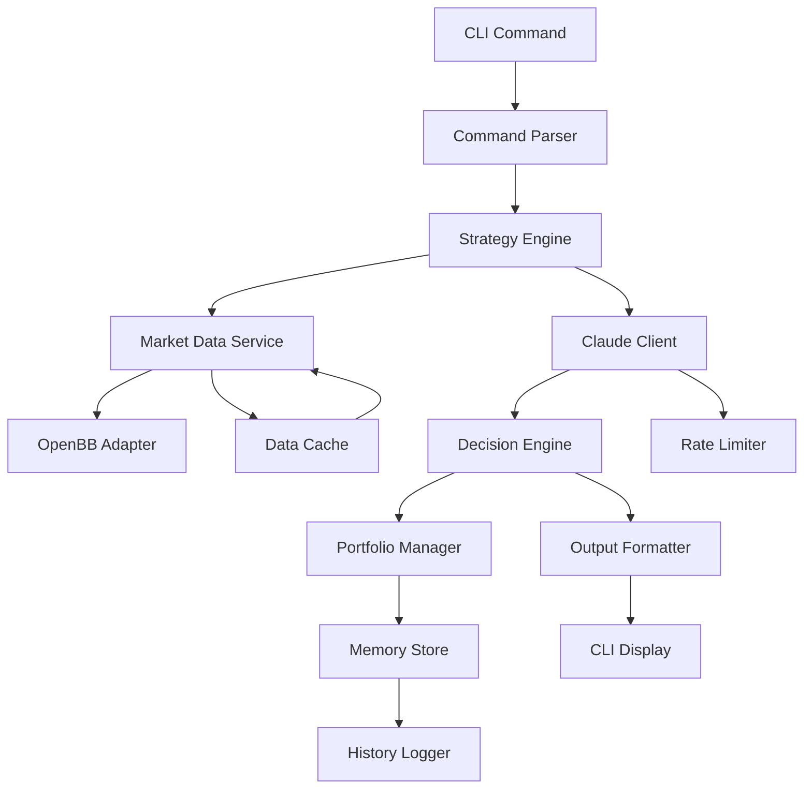

# Architecture Globale - Agent IA Financier

## Vue d'Ensemble du Système

L'agent IA financier est conçu selon une architecture modulaire en couches permettant une séparation claire des responsabilités et une extensibilité future.

## Composants Principaux

### 1. Interface Layer (Couche Interface)
- **CLI Handler** : Point d'entrée principal, gestion des commandes
- **Command Parser** : Analyse et validation des commandes utilisateur
- **Output Formatter** : Formatage des résultats pour affichage CLI

### 2. Business Logic Layer (Couche Logique Métier)
- **Strategy Engine** : Moteur d'exécution des stratégies utilisateur
- **Decision Engine** : Génération des recommandations d'achat/vente
- **Portfolio Manager** : Gestion et suivi du portefeuille
- **Performance Tracker** : Calcul et suivi des performances

### 3. AI Integration Layer (Couche Intégration IA)
- **Claude Client** : Interface avec Claude via OpenRouter
- **Prompt Manager** : Gestion des prompts optimisés
- **Context Builder** : Construction du contexte pour l'IA
- **Response Parser** : Analyse des réponses de l'IA

### 4. Data Layer (Couche Données)
- **OpenBB Adapter** : Interface avec OpenBB pour données financières
- **Data Cache Manager** : Gestion du cache des données
- **Market Data Service** : Normalisation des données de marché
- **Data Validator** : Validation et nettoyage des données

### 5. Persistence Layer (Couche Persistance)
- **Memory Store** : Stockage de la mémoire persistante
- **Configuration Manager** : Gestion des configurations
- **Strategy Repository** : Stockage des stratégies utilisateur
- **History Logger** : Journalisation des décisions et résultats

### 6. Core Services (Services Transversaux)
- **Error Handler** : Gestion centralisée des erreurs
- **Logger Service** : Système de logging unifié
- **Security Manager** : Gestion des clés API et sécurité
- **Rate Limiter** : Contrôle des appels API externes

## Architecture en Couches

```
┌─────────────────────────────────────────────────────────┐
│                    CLI Interface                         │
│  ┌─────────────┐  ┌─────────────┐  ┌─────────────┐      │
│  │ CLI Handler │  │ Cmd Parser  │  │ Output Fmt  │      │
│  └─────────────┘  └─────────────┘  └─────────────┘      │
└─────────────────────────────────────────────────────────┘
                            │
┌─────────────────────────────────────────────────────────┐
│                 Business Logic Layer                     │
│  ┌─────────────┐  ┌─────────────┐  ┌─────────────┐      │
│  │ Strategy    │  │ Decision    │  │ Portfolio   │      │
│  │ Engine      │  │ Engine      │  │ Manager     │      │
│  └─────────────┘  └─────────────┘  └─────────────┘      │
└─────────────────────────────────────────────────────────┘
                            │
┌─────────────────────────────────────────────────────────┐
│                 AI Integration Layer                     │
│  ┌─────────────┐  ┌─────────────┐  ┌─────────────┐      │
│  │ Claude      │  │ Prompt      │  │ Context     │      │
│  │ Client      │  │ Manager     │  │ Builder     │      │
│  └─────────────┘  └─────────────┘  └─────────────┘      │
└─────────────────────────────────────────────────────────┘
                            │
┌─────────────────────────────────────────────────────────┐
│                    Data Layer                           │
│  ┌─────────────┐  ┌─────────────┐  ┌─────────────┐      │
│  │ OpenBB      │  │ Data Cache  │  │ Market Data │      │
│  │ Adapter     │  │ Manager     │  │ Service     │      │
│  └─────────────┘  └─────────────┘  └─────────────┘      │
└─────────────────────────────────────────────────────────┘
                            │
┌─────────────────────────────────────────────────────────┐
│                 Persistence Layer                       │
│  ┌─────────────┐  ┌─────────────┐  ┌─────────────┐      │
│  │ Memory      │  │ Config      │  │ Strategy    │      │
│  │ Store       │  │ Manager     │  │ Repository  │      │
│  └─────────────┘  └─────────────┘  └─────────────┘      │
└─────────────────────────────────────────────────────────┘
```

## Flux de Données Principal



## Patterns de Conception Recommandés

### 1. Repository Pattern
- Abstraction de la persistance des données
- Facilite les tests et le changement de backend

### 2. Strategy Pattern
- Implémentation flexible des différentes stratégies d'analyse
- Permet l'ajout facile de nouvelles stratégies

### 3. Factory Pattern
- Création d'instances de stratégies selon configuration
- Instanciation des différents services

### 4. Observer Pattern
- Notification des changements de portefeuille
- Alertes sur événements significatifs

### 5. Command Pattern
- Encapsulation des commandes CLI
- Facilite l'ajout de nouvelles commandes

### 6. Adapter Pattern
- Interface uniforme avec différentes sources de données
- Abstraction des APIs externes (OpenBB, Claude)

## Principes Architecturaux

### 1. Separation of Concerns
- Chaque couche a une responsabilité bien définie
- Couplage faible entre les composants

### 2. Dependency Injection
- Inversion de contrôle pour la testabilité
- Configuration centralisée des dépendances

### 3. Single Responsibility
- Chaque classe/module a une seule raison de changer
- Fonctions et classes focalisées

### 4. Open/Closed Principle
- Ouvert à l'extension, fermé à la modification
- Extensibilité via plugins et stratégies

### 5. Fail-Fast
- Détection rapide des erreurs
- Validation en amont des données

## Considérations de Performance

### 1. Caching Strategy
- Cache L1 : Mémoire (données fréquemment accédées)
- Cache L2 : Disque (données historiques)
- TTL configurables par type de données

### 2. Lazy Loading
- Chargement différé des données volumineuses
- Initialisation à la demande des services

### 3. Connection Pooling
- Réutilisation des connexions externes
- Gestion efficace des ressources réseau

### 4. Batch Processing
- Regroupement des appels API
- Optimisation des requêtes externes